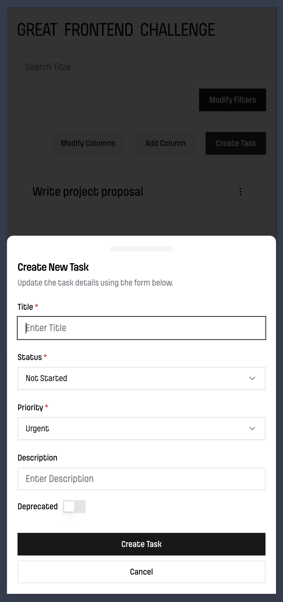

# Tasks CRUD Challenge

Built using React, TypeScript, Tailwind, Shadcn.

## Functionalities

1: Create new tasks

2: Edit existing tasks

3: Delete existing tasks

4: Create new columns

5: Delete custom columns

6: Delete custom columns

7: Filters

8: Search

